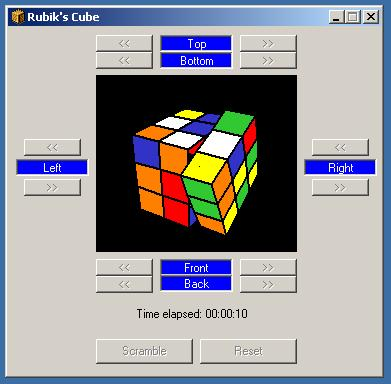



## Enhanced 3D Rubiks Cube \(OCX Control\)

### Description

I've download this program here in Planet-Source-Code, I just enhanced it, organize its buttons and convert it to an OCX control. Don't need a vote, I'm just sharing these codes..
 
### More Info
 

             |
---                |---
**Submitted On**   |2004-12-08 03:55:06
**By**             |[Uchiha Yueh](https://github.com/Planet-Source-Code/PSCIndex/blob/master/ByAuthor/uchiha-yueh.md)
**Level**          |Intermediate
**User Rating**    |4.9 (54 globes from 11 users)
**Compatibility**  |VB 5\.0, VB 6\.0
**Category**       |[Graphics](https://github.com/Planet-Source-Code/PSCIndex/blob/master/ByCategory/graphics__1-46.md)
**World**          |[Visual Basic](https://github.com/Planet-Source-Code/PSCIndex/blob/master/ByWorld/visual-basic.md)
**Archive File**   |[Enhanced\_318310412192004\.zip](https://github.com/Planet-Source-Code/uchiha-yueh-enhanced-3d-rubiks-cube-ocx-control__1-57805/archive/master.zip)

